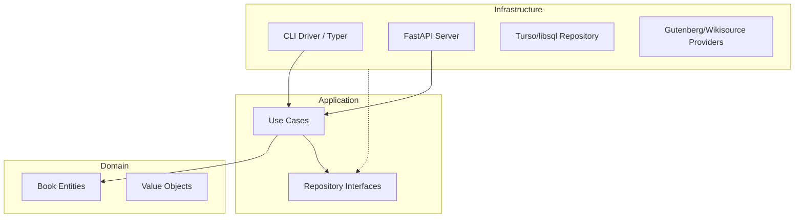

# 📚 BiblioCLI

[](https://bibliocli.vercel.app/)
[](https://www.python.org/)
[](LICENSE)

Uma ferramenta poderosa e unificada para buscar, baixar e formatar livros de fontes públicas como **Project Gutenberg**, **Wikisource** e **Open Library**.

Este projeto foi desenhado sob os princípios da **Clean Architecture**, servindo tanto como uma ferramenta CLI de alta performance quanto como um **Nexo Digital** via Web HUD com estética Cyberpunk.

---

## 🔗 Link de Produção
Acesse a versão estável em: [https://bibliocli.vercel.app/](https://bibliocli.vercel.app/)

---

## ✨ Funcionalidades

- 🔍 **Busca Multiprovedor**: Pesquise títulos ou autores simultaneamente em várias fontes bibliográficas (Gutenberg, Wikisource, Open Library).
- 📥 **Download Inteligente**: Baixa e-books e usa **IA (OpenAI)** para remover metadados, prefácios e sumários, entregando apenas o conteúdo narrativo.
- 🏗️ **Arquitetura Profissional**: Divisão clara entre Domínio, Aplicação e Infraestrutura, garantindo manutenibilidade e testabilidade.
- 🌐 **Nexus Web HUD**: Interface web moderna com estética Cyberpunk, efeitos de _glitch_ de alta fidelidade e design responsivo.
- 🎨 **Terminal Rico**: Tabelas, barras de progresso e CLI interativa via `Rich` e `Questionary`.

---

## 🛠️ Stack Tecnológica

- **Core**: Python 3.12+ & [uv](https://github.com/astral-sh/uv)
- **API**: FastAPI & Uvicorn
- **Banco de Dados**: Turso (libsql) para persistência de livros formatados.
- **UI Terminal**: Rich & Questionary
- **UI Web**: Vanilla JS (ES6+), CSS3 (Cyberpunk Design System)
- **IA**: OpenAI API (GPT-4o/o1)

---

## 🚀 Como Começar

### Instalação

1. Clone o repositório:
   ```bash
   git clone https://github.com/alexandermarquesm/bibliocli.git
   cd bibliocli
   ```
2. Instale as dependências com `uv`:
   ```bash
   uv sync
   ```

### Configuração de IA & Banco de Dados

Crie um arquivo `.env` na raiz do projeto:

```env
OPENAI_API_KEY="sua-chave-aqui"
TURSO_URL="sua-url-turso"
TURSO_AUTH_TOKEN="seu-token-turso"
```

---

## 🕹️ Modos de Uso

### 1. Interface de Linha de Comando (CLI)

O projeto define atalhos otimizados via `uv`.

- **Modo Interativo:**
  ```bash
  uv run bibliocli
  ```

- **Buscar Livros (Direto):**
  ```bash
  uv run bibliocli search "Dom Casmurro" --book
  ```

- **Download Direto:**
  ```bash
  uv run bibliocli download "URL_DO_LIVRO" --name "nome.txt"
  ```

### 2. Nexus Web HUD (Interface Moderna)

Inicia o servidor web local com interface gráfica.

```bash
uv run bibliocli-server
```

> [!TIP]
> Com o servidor rodando, acesse `http://127.0.0.1:8000` para a interface gráfica ou `/docs` para a documentação Swagger da API.

---

## 🏛️ Clean Architecture

O BiblioCLI segue rigorosamente a separação de responsabilidades para garantir escalabilidade:



---

## 📄 Licença

Distribuído sob a licença MIT. Veja `LICENSE` para mais informações.

---

_Feito com ⚡ por [Alexander Marques](https://github.com/alexandermarquesm)_
